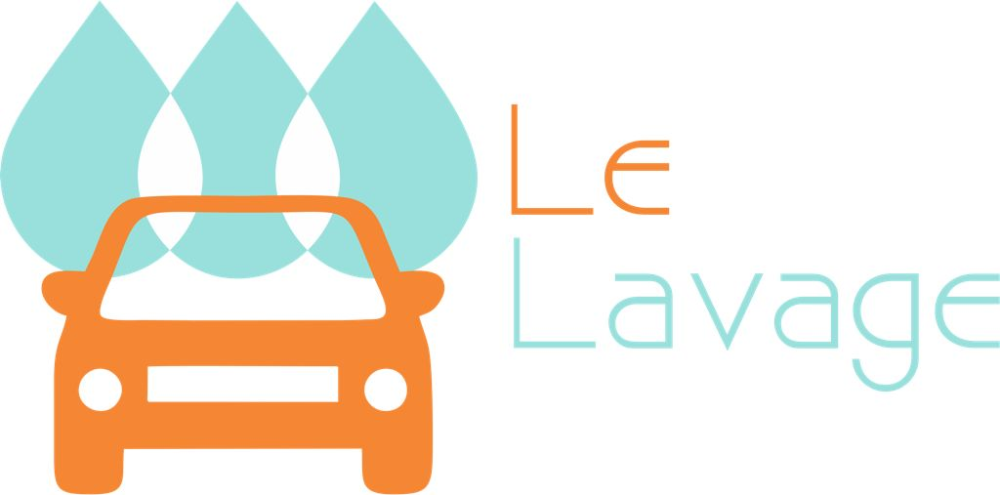

</a>

# "DESARROLLO DE SOFTWARE PARA EL CONTROL DE VENTAS DE UN AUTOLAVADO"

_Se creó un sistema de control de ventas para el auto lavado “Le Levage” que permite llevar un registro de ventas; facilitando la administracion y monitoreo de el negocio. 
Se hizo uso de la metodología XP, cuyas bases son la simplicidad y adaptabilidad que se adaptan perfectamente a las necesidades del proyecto._

## Autores ✒️

_El equipo se conforma por:_

* **Saúl Galvan Alvarado** - [Saul-Galvan-Alvarado-1999](https://github.com/Saul-Galvan-Alvarado-1999)
* **Daniela Téllez Morales** -  [DanielaTellez01](https://github.com/DanielaTellez01)
* **Flor Sarai Santiago Leonardo** - [SaraiSan17](https://github.com/SaraiSan17)
* **Maria José Segovia Santamaría**- [fulanitodetal](#fulanito-de-tal)

También puedes mirar la lista de todos los [contribuyentes](https://github.com/Saul-Galvan-Alvarado-1999/Autolavado-Le_Lavage/graphs/contributors) quíenes han participado en este proyecto. 

## Construido con 🛠️

_Herramientas:_

* [Laravel](https://laravel.com/) - El framework web usado
* [MySQL](https://www.mysql.com/) - Gestor de Base de Datos
* [Visual Studio Code](https://code.visualstudio.com/) - Editor de Texto

## Gratitud 🎁

* 📢 Agradecemos a nuestro profesor Lic. Ricardo Luna, por sus conocimientos que hizo a bien compartirnos 🤓

